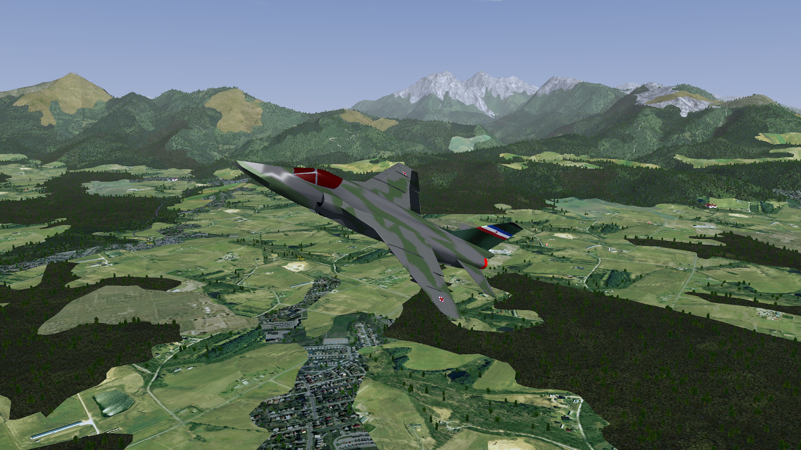

# Soko J-22 Orao / IAR 93 for FlightGear

## Description

This is a home of [J-22 Orao)](https://en.wikipedia.org/wiki/Soko_J-22_Orao)
aircraft for FlightGear an open-source flight simulator.

J-22 Orao ("Eagle") is a single seat twin engine attack aircraft. It is the result of
coorporation between Yugoslavian and Romanian flight industry. First
flight was taken in 1974, the first attack variant was launched in 1983. J-22
(IAR 93 in Romania) is a low-cost aircraft and therefore appropriate for less
economically developed countries. However, it includes advanced parts as well
like HUD, laser-aimed altitude, night-vision and radion-avigation controls.
There is also a two-seat training variant of this aircraft.

## Installation

To install this aircraft simply clone the repository into `$FG_ROOT/Aircraft/j22`.

## History

Development of this model started in early 2001 for Falcon 4.0 Balkans theatre.
Initial work started in 3D Studio MAX and a low-poly version of the model was
exported. Later the model was reworked from scratch for FlightGear in Blender.

## Features

- full 3D model
- basic flight model
- gear, canopy animation

## TODO

- more realistic flight model
- 3d cockpit
- avionics inlc. HUD, radar, armament system etc.
- more model animations (airbrakes)

# Repository structure

- j22-set.xml: Aircraft metadata.
- j22-yasim.xml: Flight model wrapper file 
- Models/: J-22 3D model in .ac format and textures in .rgb format. Model
  animations are in j22.xml file.
- Source/: Blender source file of 3D model.

# Support

If you have any questions or issues, don't hesitate to open github issue.
